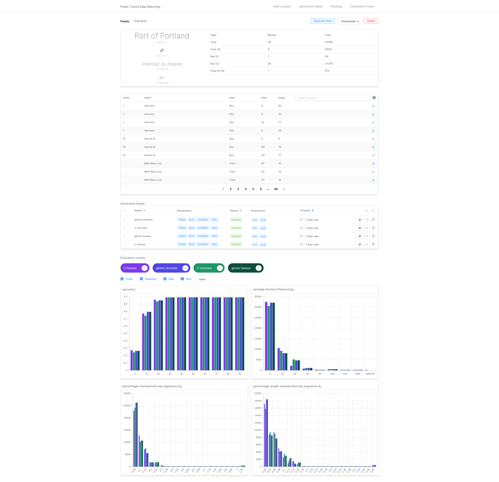

# TransitRouter - public transit map matching with GraphHopper

*TransitRouter* is a web application for generating high quality shape files for GTFS (*General Transit Feed Specification*) feeds using the map matching approach described in [Hidden Markov Map Matching Through Noise and Sparseness](https://www.ismll.uni-hildesheim.de/lehre/semSpatial-10s/script/6.pdf).

*TransitRouter* uses the OSM routing engine [GraphHopper]() and a modified version the [GraphHopper Map Matching library]() that enables turn restrictions and tries to prevent inter hop turns.

This repo is for my bachelor thesis and project at the chair of algorithms and datastructures at the university of Freiburg.

## Technologies
- Java 11
- Quarkus
- GraphHopper
- Vue.js

## Setup:

Download the osm file (*.osm.pbf*) of the region you want to generate feeds in. You can find them at [Geofabrik](http://download.geofabrik.de/)

Set the *app.gh.osm* property to your osm file path. This can be done in application.properties file or via env variables.

Set the *app.evaluation-tool* property to *shapevl* located in your project root folder. Make sure *shapevl* can be executed. (If you use docker you can skip this)

- osm file for Baden-Württemberg: [download](http://download.geofabrik.de/europe/germany/baden-wuerttemberg-latest.osm.pbf)
- GTFS Feed Stuttgart: [download](https://www.openvvs.de/dataset/e66f03e4-79f2-41d0-90f1-166ca609e491/resource/bfbb59c7-767c-4bca-bbb2-d8d32a3e0378/download/vvs_gtfs.zip)

The tests currently require the osm file of Baden-Württemberg. This will (hopefully) change in the near future.
At the moment the app is not very well tested (shame on me)

## Development
run `./mvnw clean quarkus:dev` to start the quarkus backend. The API is available via localhost:8080

run `npm run hot` inside the frontend module to. You can visit the site via localhost:9000
Inside *frontend/src/Config.js* set *apiEndpoint* to http://localhost:8080

## Production
The frontend will be served by the quarkus backend.

Inside *frontend/src/Config.js* set *apiEndpoint* to an empty string and run `npm run prod` inside the frontend module. This compiles and copies all files inside the backend resource folder.

run `./mvnw clean package` to compile the project

## Docker
compile project: `./mvnw clean package -Dmaven.test.skip=true`

### with docker-compose
bind volume in docker-compose.yaml

run `docker-compose build` and `docker-compose up -d`

### with DockerFile
`sudo docker build -t michael-fleig-project .`

`
sudo docker run -i --rm -p 8080:8080 --name <name> <name>`

make sure to set the env variables (see docker-compose.yaml)

 