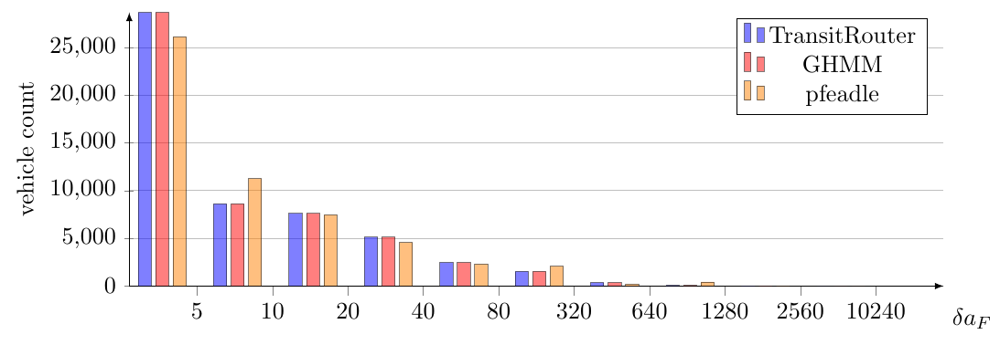
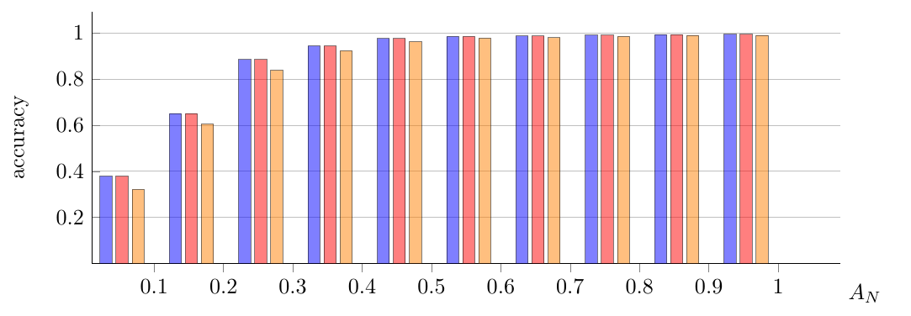
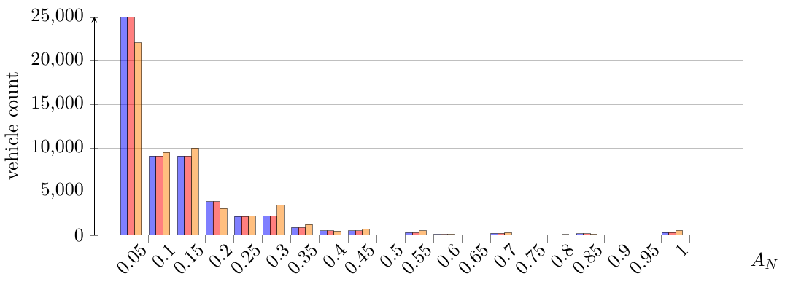
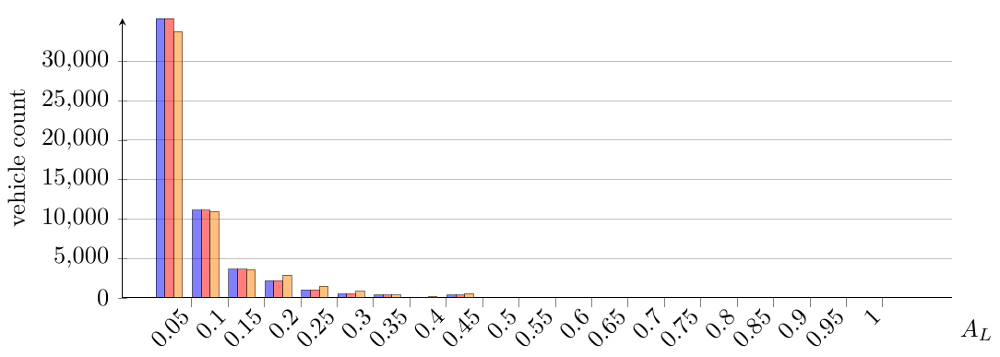
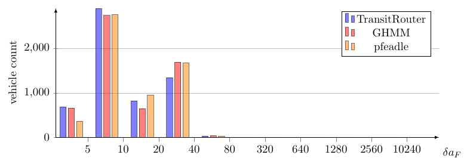
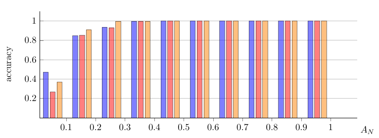
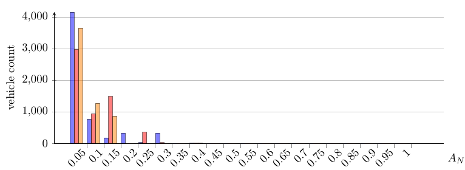
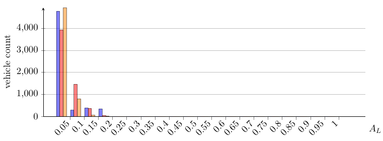

# Evaluation

## Metrics

To evaluate the quality of our generated shapes we use three different metrics where we compare a generated path P with the corresponding path Q of the ground truth.

### Average Frèchet Distance $\delta_{a_F}$
We split the paths $P$ and $Q$ into an equal number of segments such that the segments in $P$ have a length of 1m. Then $\delta_{a_F}$ is the average of the Frèchet Distance between the segments in $P$ and $Q$.

### Percentage of unmatched hop segments $A_N$
A *hop segment* is the path between two station / hops.
A *hop segment* is mismatched its Frèchet Distance is $\geq$ 20m.
$$A_N = \frac{\text{\#unmatched hop segments}}{\text{\#hop segments}}$$ 

### Percentage of length of unmatched hop segments $A_L$
$$A_L = \frac{\text{length of unmatched segments}}{\text{length ground truth}}$$

## GraphHopper Map Matching base line (*GHMM*)
The GraphHopper Map Matching is a one to one implementation of [Hidden Markov Map Matching Through Noise and Sparseness](https://www.ismll.uni-hildesheim.de/lehre/semSpatial-10s/script/6.pdf).
To be used as a base line we removed the filtering of close observations described in chapter 4.1 as this removes consecutive stations that are to close to one another.

## Stuttgart

*Average Frèchet Distance $\delta_{a_F}$ histogram*

*Accuracy*

*Percentage of unmatched hop segments $A_N$*

*Percentage of length of unmatched hop segments $A_L$*

## Victoria-Gasteiz

*Average Frèchet Distance $\delta_{a_F}$ histogram*

*Accuracy*

*Percentage of unmatched hop segments $A_N$*

*Percentage of length of unmatched hop segments $A_L$*

## Current problems and further research

### Inter-hop turn restrictions are not properly reflected in the HMM

### Path finding difficulties with turn restrictions
With turn restrictions enabled for some trips GraphHopper is not able to find any path between the candidates of two stations. If this happens we disable turn restrictions for that particular trip. For Stuttgart this affects around $10\%$ of all trips. For Victoria-Gasteiz none of the trips is affected.

At the moment we were not able to find the reasons why GraphHopper is not able to find any path. This issue needs further investigation.

### Use OSM metadata
OSM provides useful information about public transit routes which might increase the quality of the generated shapes.