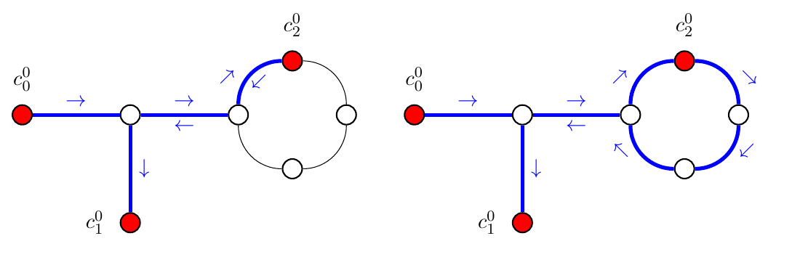

# Introduction

*TransitRouter* is a web application for generating shape files of GTFS feeds using a map matching approach described in the paper [Hidden Markov Map Matching Through Noise and Sparseness](https://www.ismll.uni-hildesheim.de/lehre/semSpatial-10s/script/6.pdf).

*TransitRouter* uses the OSM routing engine [GraphHopper]() and a modified version the [GraphHopper Map Matching library](). 

## General Transit Feed Specification GTFS

## Limitations of the GraphHopper Map Matching library
- removes stations that are to close
- no turn restrictions / costs
- no support for inter hop turns restrictions

## Our map matching approach
Given a trip $T$  with a ordered sequence of stations $S = (s_0, s_1, s_2, ..., s_n)$ we want to find its path $P$ through our street network graph $G=(V, E)$.

### Finding candidates
The GPS positions of our stations might not be accurate so we cannot use them directly to find our path. 

For each station $s_i$ we want to find a set of possible candidates $C_i$. To construct $C_i$ we use the following approach:

For every edge $e_j \in E$ within a radius $r$ around $s_i$ calculate the projection $p_{i,j}$ of $s_i$ on $e_j$. Then for each outgoing edge $e_k$ of $p_{i,j}$ we add a candidate $c_i^{k} = (p_{i,j}, e_k)$ to $C_i$. So a candidate consists of a position in out road network and a direction in which we can drive.

Note that we could have used *orientation less* candidates consisting only of the projection $p_{i,j}$ but we the direction to enable turn restrictions which we will see at a later point.

### Hidden Markov Model *HMM*
To find the most likely sequence of candidates we use a Hidden Markov Model (*HMM*) with our stations $s_i$ as observations and our candidates $C_i$ as observations. The approach is based on **TODO**

#### Emission probability
The emission probability $p(s_i | c_i^k)$ describes the likelihood that we observed $s_i$ given that $c_i^k$ is a matching candidate.

We use the great circle distance $d$ between the station $s_i$ and its candidate node $c^i_k$ and apply a weighting function with the tuning parameter $\sigma$.

$$d=\|s_i - c_i^k\|_{\text{great circle}}$$
$$p(s_i | c_i^k) = \frac{1}{\sqrt{2\pi}\sigma}e^{0.5(\frac{d}{\sigma})^2}$$

#### Transition probability
For the transition probability $p(c_i^k \rightarrow c_{i+1}^j)$ describes the likelihood that our next state will be $c_{i+1}$ given our current state is $c_i^k$.
We use the distance difference $d_t$ between the great circle distance of the two stations $s_i, s_{i+1}$ and the length of the road path between the two candidates $c_i^k, c_{i+1}^j$ and apply out weighting function with tuning parameter $\beta$.

$$d_t = | \|s_i - s_{i+1}\|_{\text{great circle}} - \| c_i^k - c_{i-1}^j \|_{\text{route}} |$$
$$p(c_i^k \rightarrow c_{i+1}^j)=\frac{1}{\beta}e^{\frac{d_t}{\beta}}$$

## Turn restrictions
For our bus routes we want to prevent forbidden and unlikely turns. GraphHopper has built in support for turn restrictions based on osm meta data and for turn costs. But if we calculate the path between candidates only using there position we run into the problem of inter hop turns.

Consider the following example:

Having no information from which direction we arrived at candidate $c^0_1$ the most likely path to $c^0_2$ would include a full turn which is unlikely for busses and might even be forbidden at that position by traffic rules.

In GraphHopper we can specify a start and end edge when finding the path between two nodes. We use this to enable turn restrictions between hops.
Given two candidates $c_1 = (u_1, e_1), c_2 = (u_2, e_2)$. Let $v$ be the neighbor of $u_2$ connected by $e_2$. Then we calculate the path $P_1$ from $u_1$ starting with edge $e_2$ to $v$ ending with $e_2$. 
When we combine the most likely paths $P_i$ to get the whole path $P$ we remove the last edge from every $P_i$.